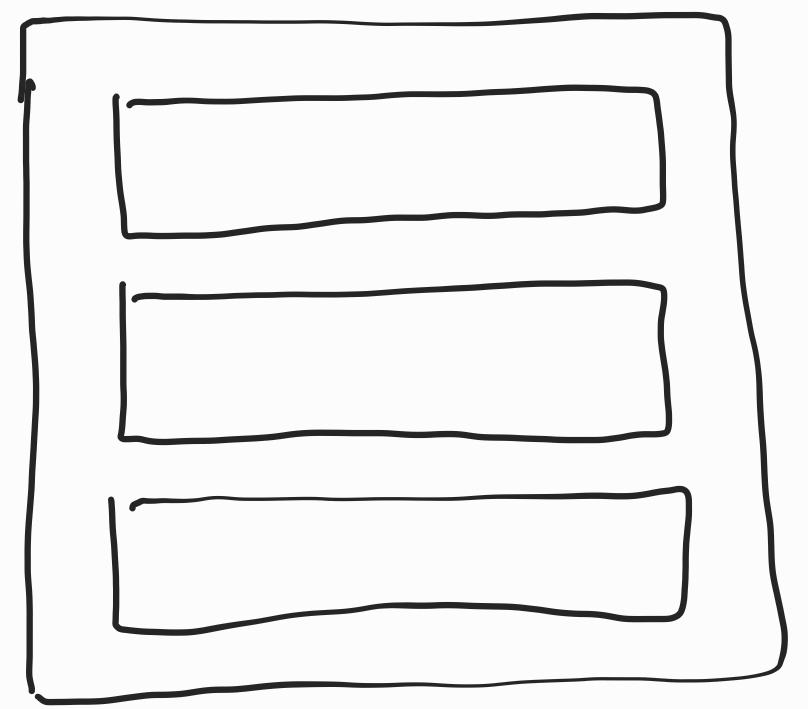
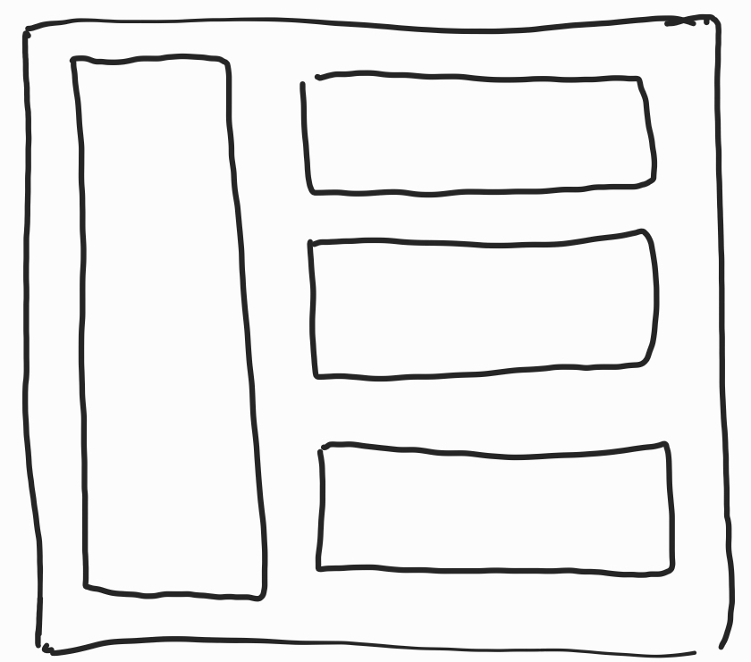

# Community.Sextant.WinUI

`Community.Sextant.WinUI` is a plugin for [reactiveui/Sextant: A ReactiveUI navigation library](https://github.com/reactiveui/Sextant). It adds support for [Windows UI Library (WinUI) 3](https://docs.microsoft.com/en-us/windows/apps/winui/winui3/).

## Getting Started

### Installation

```shell
dotnet add Community.Sextant.WinUI
```

Depending on which[Dependency Injection](https://de.wikipedia.org/wiki/Dependency_Injection) framework you are using, you can install a different helper package:

* [reactiveui/splat: Makes things cross-platform](https://github.com/reactiveui/splat):  
  
  ```shell
  dotnet add Community.Sextant.WinUI.Splat
  ```

* [Microsoft.Extensions.DependencyInjection](https://docs.microsoft.com/en-us/dotnet/core/extensions/dependency-injection):
  
  ```shell
  dotnet add Community.Sextant.WinUI.Microsoft.Extensions.DependencyInjection
  
  awdawd
  adawda
  ```
  
  > NOTE: `Sextant` and `reactiveui` both always use `Splat` but `Splat` can use  `Microsoft.Extensions.DependencyInjection` as internal dependency resolver. Please see the [Advanced Integration Tutorial of Splat](https://github.com/reactiveui/splat/blob/main/src/Splat.Microsoft.Extensions.DependencyInjection/README.md) for more details.

* `Your favorite DI`: Please create a feature request for it!

## Configuration

### Using `Splat`

In your `App.xaml.cs`:

```csharp
public partial class App : Application
{
    public App()
    {
        this.InitializeComponent();

        Init();
    }

    /// Add this method and call in the constructor after this.InitializeComponent();
    void Init()
    {
        // Recommended
        RxApp.DefaultExceptionHandler = new SextantDefaultExceptionHandler();
        Locator.CurrentMutable.RegisterViewsForViewModels(Assembly.GetCallingAssembly());
        
        // Required
        Locator.CurrentMutable
            .RegisterWinUIViewLocator()
            .RegisterParameterViewStackService()
            .RegisterViewStackServiceFromParameterService()
            .RegisterNavigationView()
            .RegisterConstantAnd<IDialogManager>(new DialogManager());
        // Will be expanded later...
    }
}
```

### Using Microsoft DI:

```csharp
public partial class App : Application
{
    public App()
    {
        this.InitializeComponent();

        Init();
    }

    // Add this code block

    public IServiceProvider? Container { get; private set; }

    /// Call this method in the constructor after this.InitializeComponent();
    void Init()
    {
        RxApp.DefaultExceptionHandler = new SextantDefaultExceptionHandler();
        var host = Host.CreateDefaultBuilder()
            .ConfigureServices(
                services =>
                {
                    services.UseMicrosoftDependencyResolver();
                    var resolver = Locator.CurrentMutable;
                    resolver.InitializeSplat();
                    resolver.InitializeReactiveUI();

                    // Configure our local services and access the host configuration
                    ConfigureServices(services);

                    // Configure Sextant, Views and ViewModels
                    services.UseSextant(
                        builder =>
                        {
                            builder.ConfigureDefaults();
                            builder.ConfigureViews(
                                viewBuilder =>
                                {
                                    // Will be expanded later...
                                }
                            );
                        }
                    );
                }
            )
            .UseEnvironment(Environments.Development)
            .Build();

        // Since MS DI container is a different type,
        // we need to re-register the built container with Splat again
        Container = host.Services;
        Container.UseMicrosoftDependencyResolver();
    }

    void ConfigureServices(IServiceCollection services)
    {
        // register your other services here
    }
}
```

## Connect with your `UI`

`Community.Sextant.WinUI` needs to know where to push pages and models to. Typically a [Frame Class](https://docs.microsoft.com/en-us/windows/winui/api/microsoft.ui.xaml.controls.frame?view=winui-3.0) is used for that. In combination with a [NavigationView Class](https://docs.microsoft.com/en-us/windows/winui/api/microsoft.ui.xaml.controls.navigationview?view=winui-3.0) you can create a simple application with dynamic routing.

<div>
<table>
  <tr>
    <td>
        
    </td>
    <td>
        
    </td>
    <td>
        
    </td>
  </tr>
  <tr>
    <td>
        A simple Frame only
    </td>
    <td>
        A Frame and NavigationView
    </td>
    <td>
        Integrate any control!
    </td>
  </tr>
</table>
</div>

#### A simple Frame

```csharp
// Tell navigation service which <Frame /> to use
// A reference to the containing <Window /> is also needed for Popups.
_navigationService.SetAdapter(new FrameNavigationViewAdapter(MyFrame, MyWindow));
```

#### A Frame and NavigationView

```csharp
// Tell navigation service which <Frame /> && <NavigationView /> to use
// A reference to the containing <Window /> is also needed for Popups.
_navigationService.SetAdapter(
    new NavigationViewAdapter(MyFrame, MyWindow, MyNavigationView)
);
```

#### Integrate any control

You can implement `INavigationViewAdapter` and cover your own use cases easily.

## Add your view models

You need to register your `View`s and `ViewModels` other `Sextant` cannot find and create them. This is a separate step from the usual service registration.

### Using `Splat`

```csharp
Locator.CurrentMutable
    .RegisterViewWinUI(
        () => new MyView(),
        () => new MyViewModel()
    )
```

### Using Microsoft DI:

```csharp
viewBuilder.RegisterViewAndViewModel<
    MyView,
    MyViewModel
>();
```

`viewBuilder` is available in the `ConfigureViews` call.

## 
